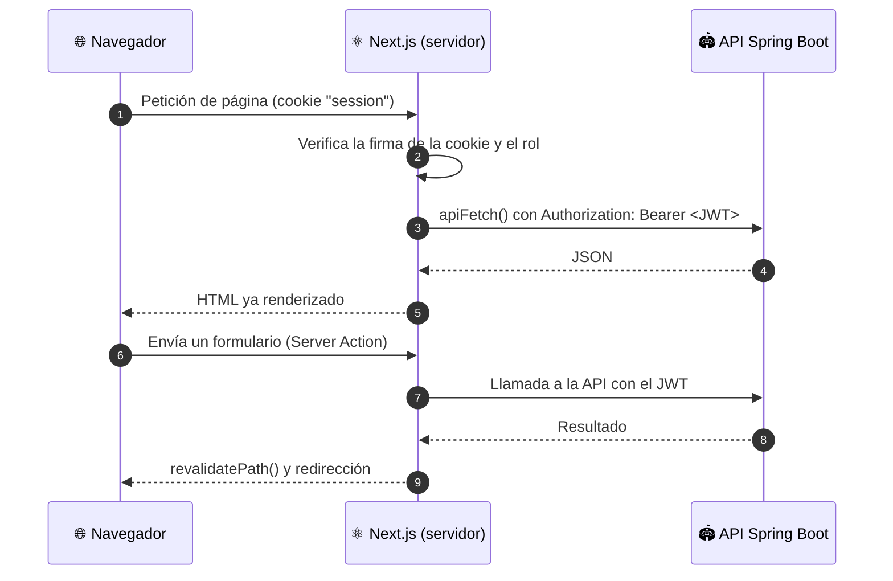

<div align="center">

# ⚡ Sportly · Frontend

**Aplicación web para reservar canchas deportivas y administrar sedes**

Explora y reserva · paquetes y pagos · partidos, equipos y torneos · recepción con lector de QR · reportes

[](https://github.com/Rodrigo-Salva/court-reservation-front/actions/workflows/ci.yml)


[Inicio rápido](#-inicio-rápido) · [Funcionalidades](#-funcionalidades) · [Arquitectura](#-arquitectura) · [Pantallas](#-pantallas-y-acceso) · [Despliegue](#-despliegue)

</div>

---

## 📑 Tabla de contenidos

1. [Funcionalidades](#-funcionalidades)
2. [Stack tecnológico](#-stack-tecnológico)
3. [Arquitectura](#-arquitectura)
4. [Inicio rápido](#-inicio-rápido)
5. [Configuración](#-configuración)
6. [Pantallas y acceso](#-pantallas-y-acceso)
7. [Lector de QR con cámara](#-lector-de-qr-con-cámara)
8. [Scripts](#-scripts)
9. [Pruebas y calidad](#-pruebas-y-calidad)
10. [Estructura del proyecto](#-estructura-del-proyecto)
11. [Despliegue](#-despliegue)
12. [Solución de problemas](#-solución-de-problemas)

> **Backend:** este frontend consume [court-reservation-api](https://github.com/Rodrigo-Salva/court-reservation-api). Necesitas tenerlo corriendo para usar la aplicación.

---

## ✨ Funcionalidades

### 🧑 Para jugadores

| | |
|---|---|
| 🔎 **Explorar** | Catálogo público de canchas con filtros por deporte y precio, disponibilidad por día y reseñas |
| 📅 **Reservas** | Asistente de reserva (horario, paquete, recurrencia), reprogramar, cancelar con penalización visible, **QR de check-in** y pago de reservas pendientes |
| 📦 **Paquetes y pagos** | Comprar horas prepagadas, pagar (simulado) y ver comprobantes |
| ⏳ **Lista de espera** | Anotarse cuando un horario está ocupado |
| 🤝 **Comunidad** | Publicar partidos y **aceptar o rechazar** solicitudes, inscribirse en torneos, ver **fixture, resultados y ranking** |
| 👥 **Equipos** | Crear equipos, **invitar por email**, responder invitaciones, quitar integrantes o abandonar |
| ⭐ **Reseñas** | Calificar una cancha tras completar una reserva |
| 🔔 **Notificaciones** | Bandeja de actividad y perfil editable |

### 🧑‍💼 Para el personal

| | |
|---|---|
| 🛎️ **Recepción** | Check-in con **cámara (QR)** o manual, no-show y reservas confirmadas paginadas |
| 🚧 **Bloqueos** | Bloquear canchas por mantenimiento, feriado o evento |
| 🏟️ **Administración** | Resumen de ocupación e ingresos, gestión de canchas; el `ADMIN` también gestiona usuarios (paginados) y paquetes |
| 🏢 **Sedes** | Crear sedes y **mover canchas entre sedes** |
| 💳 **Transacciones** | Buscar pagos, ver totales y **reembolsar** |
| ⭐ **Moderación** | Ocultar, mostrar o eliminar reseñas |
| 🏆 **Torneos** | Crear torneos (por sede), generar fixture y **registrar resultados** |
| 📊 **Reportes** | Gráficos con filtros por sede, cancha y deporte; descarga en **PDF, XLSX y CSV** |

Las cuentas `VENUE_ADMIN` y `RECEPTIONIST` **solo ven y modifican los datos de su sede**.

---

## 🧰 Stack tecnológico

| Área | Tecnología |
|---|---|
| Framework | **Next.js 16** (App Router) · **React 19** · TypeScript 5 |
| Estilos | Tailwind CSS 4 |
| Iconos | `lucide-react` |
| QR | `qrcode.react` (mostrar) · `html5-qrcode` (escanear con cámara) |
| Calidad | ESLint 9 · Vitest 3 · `tsc --noEmit` |
| CI | GitHub Actions |

---

## 🏗️ Arquitectura

La aplicación usa **Server Components** para leer datos y **Server Actions** para modificarlos: el navegador **nunca** habla con la API ni ve su URL o el token.



**Decisiones clave**

- **Sesión:** cookie `session` **httpOnly**, `sameSite=lax` (`secure` en producción), firmada con **HMAC-SHA256** (`SESSION_SECRET`). Guarda el JWT, el nombre, el rol y el id; dura 24 h.
- **Protección de rutas en tres niveles:** `proxy.ts` (redirige a login si no hay sesión) → cada página y Server Action valida el rol → el backend vuelve a autorizar. Ocultar un enlace **nunca** es la única barrera.
- **`lib/api.ts`** (`server-only`) centraliza `fetch`, el token y el manejo de errores (`ApiError`).
- **Estado en la URL:** filtros y páginas viajan como `searchParams`, así los listados se pueden compartir y funcionan sin JavaScript.
- **Componentes de cliente** solo donde hace falta interactividad: asistente de reserva, lector de QR, formularios con modal, pestañas del panel.

---

## 🚀 Inicio rápido

### Requisitos

- **Node.js 20.9 o superior** (se prueba con Node 22) y npm.
- El **backend** corriendo en `http://localhost:8080` (ver su [README](https://github.com/Rodrigo-Salva/court-reservation-api#-inicio-rápido)).

### Pasos

```bash
git clone https://github.com/Rodrigo-Salva/court-reservation-front.git
cd court-reservation-front
npm install
```

Crea `.env.local` (no se versiona):

```bash
API_URL=http://localhost:8080
SESSION_SECRET=<cadena aleatoria de al menos 32 caracteres>
```

```bash
# Genera el secreto
openssl rand -base64 32
```

```bash
npm run dev          # http://localhost:3000
```

Entra con una cuenta de demostración del backend (perfil `dev`):

| Cuenta | Contraseña | Verás |
|---|---|---|
| `demo01@sportsbooking.com` | `demo123` | Vista de jugador |
| `recepcion@sportsbooking.com` | `recep123` | Recepción de la Sede Central |
| `venueadmin@sportsbooking.com` | `venue123` | Administración de la Sede Central |
| `admin@sportsbooking.com` | `admin123` | Administración completa |

---

## ⚙️ Configuración

| Variable | Obligatoria | Descripción |
|---|:---:|---|
| `API_URL` | ✅ | URL del backend. **Solo servidor**: no lleva `NEXT_PUBLIC_`, por lo que nunca llega al navegador |
| `SESSION_SECRET` | ✅ | Secreto para firmar la cookie de sesión (≥ 32 caracteres). En producción usa un valor único y guárdalo en un gestor de secretos |

---

## 🗺️ Pantallas y acceso

| Ruta | Acceso | Descripción |
|---|---|---|
| `/explorar` | 🌐 Público | Catálogo de canchas, filtros y reseñas |
| `/login` · `/registro` | 🌐 Público | Autenticación |
| `/reservas` · `/reservas/nueva` | 🔑 Sesión | Mis reservas y asistente de reserva |
| `/paquetes` · `/pagos` · `/espera` | 🔑 Sesión | Paquetes, pagos y lista de espera |
| `/comunidad` · `/equipos` | 🔑 Sesión | Partidos, torneos, equipos e invitaciones |
| `/torneos/[id]` | 🔑 Sesión | Fixture, resultados y ranking (los admins registran resultados) |
| `/notificaciones` · `/perfil` | 🔑 Sesión | Actividad y perfil |
| `/recepcion` | 🧑‍💼 `RECEPTIONIST`, `VENUE_ADMIN`, `ADMIN`, `SUPER_ADMIN` | Check-in por QR o manual y no-show |
| `/bloqueos` · `/administracion` · `/transacciones` · `/resenas` · `/reportes` · `/torneos` | 🧑‍💼 `VENUE_ADMIN`, `ADMIN`, `SUPER_ADMIN` | Operación de la sede (de su sede) |
| `/sedes` | 🛠️ `ADMIN`, `SUPER_ADMIN` | Sedes y canchas por sede |

> En `/administracion` el `ADMIN` ve además las pestañas **Usuarios** y **Paquetes**.

---

## 📷 Lector de QR con cámara

En **Recepción**, el botón *Activar cámara* escanea el QR de la reserva del cliente y registra el ingreso al instante; sigue escaneando y muestra los últimos resultados.

- Solo hace falta el **código** del QR (el ID de reserva es opcional en el ingreso manual).
- Requiere **HTTPS** (o `localhost`) y que el navegador tenga permiso de cámara.
- Si el QR ya se usó, es de otra sede o no existe, se muestra el motivo sin detener el lector.
- La lógica de lectura (`lib/checkinCode.ts`) acepta el UUID solo, dentro de una URL, un JSON o con prefijo, y está cubierta por pruebas.

---

## 🧾 Scripts

| Comando | Descripción |
|---|---|
| `npm run dev` | Servidor de desarrollo en `:3000` |
| `npm run build` | Compilación de producción |
| `npm start` | Sirve la compilación de producción |
| `npm run lint` | ESLint |
| `npm test` | Pruebas unitarias con Vitest |
| `npx tsc --noEmit` | Verificación de tipos |

---

## 🧪 Pruebas y calidad

- **Vitest** para la lógica pura (por ejemplo, la extracción del código de check-in).
- **ESLint** y **TypeScript estricto** en cada cambio.
- **CI** (`.github/workflows/ci.yml`): en cada push y pull request a `main` ejecuta `npm ci`, lint, tipos, pruebas y `npm run build`.

---

## 📁 Estructura del proyecto

```text
app/
├── (auth)/                Login y registro
├── (app)/                 Pantallas con sesión (layout con menú lateral)
│   ├── reservas/  paquetes/  pagos/  espera/  comunidad/  equipos/  perfil/  notificaciones/
│   ├── recepcion/  bloqueos/  administracion/  transacciones/  resenas/  reportes/  torneos/  sedes/
├── actions/               Server Actions (una por dominio: bookings, teams, payments, …)
├── explorar/              Catálogo público
└── layout.tsx · globals.css

components/
├── admin/                 Panel: resumen, canchas, usuarios, paquetes
├── QrScanner.tsx          Lector de QR con cámara
├── Pagination.tsx         Paginación por enlaces (conserva filtros)
├── charts.tsx             Gráficos SVG sin dependencias
└── BookingWizard.tsx · Sidebar.tsx · …

lib/
├── api.ts                 Cliente HTTP del servidor (apiFetch, ApiError)
├── session.ts             Cookie de sesión firmada
├── definitions.ts         Tipos que reflejan los DTO del backend
└── checkinCode.ts         Extracción del código del QR (+ pruebas)

proxy.ts                   Redirige a /login las rutas protegidas sin sesión
```

---

## 🚢 Despliegue

```bash
npm ci
npm run build
API_URL=http://127.0.0.1:8080 SESSION_SECRET=… npm start     # :3000
```

- Publícalo detrás de un proxy inverso con **HTTPS** (imprescindible para la cámara del QR). Un ejemplo de Nginx y la configuración de la API están en la [guía de despliegue del backend](https://github.com/Rodrigo-Salva/court-reservation-api/blob/main/docs/DEPLOYMENT.md).
- `API_URL` puede apuntar a la red interna: el navegador nunca se conecta a la API.
- En el backend, `CORS_ALLOWED_ORIGINS` debe coincidir con el dominio público del frontend.
- Compatible con cualquier plataforma que ejecute Node.js (VPS, PaaS, etc.).

---

## 🩺 Solución de problemas

| Síntoma | Causa y solución |
|---|---|
| *«Tu sesión ya no es válida. Cierra sesión e inicia sesión de nuevo.»* | El token ya no sirve (se reinició el backend con la base en memoria, cerraste sesión en otro lugar o cambió el `JWT_SECRET`). Sal y vuelve a entrar |
| *«No se pudo conectar con el servidor»* | El backend no está corriendo o `API_URL` es incorrecta |
| `SESSION_SECRET debe tener al menos 32 caracteres` | Define una cadena más larga en `.env.local` |
| La cámara no se activa | Falta el permiso del navegador o no estás en HTTPS/`localhost` |
| *«Another next dev server is already running»* | Ya hay un `npm run dev` abierto en este proyecto; ciérralo o usa ese |
| Faltan datos de prueba | Se cargan al arrancar el backend en perfil `dev`; reinícialo |

---

## 🤝 Contribuir

- Sigue el flujo: rama → cambios → `npm run lint && npx tsc --noEmit && npm test` → pull request.
- Los mensajes de commit siguen *Conventional Commits* (`feat:`, `fix:`, `chore:`, …).
- Esta versión de Next.js tiene diferencias respecto a versiones anteriores: consulta la documentación incluida en `node_modules/next/dist/docs/` antes de usar APIs poco comunes.

<div align="center">

Hecho con ⚛️ y ☕ por [Rodrigo Salva](https://github.com/Rodrigo-Salva)

</div>
